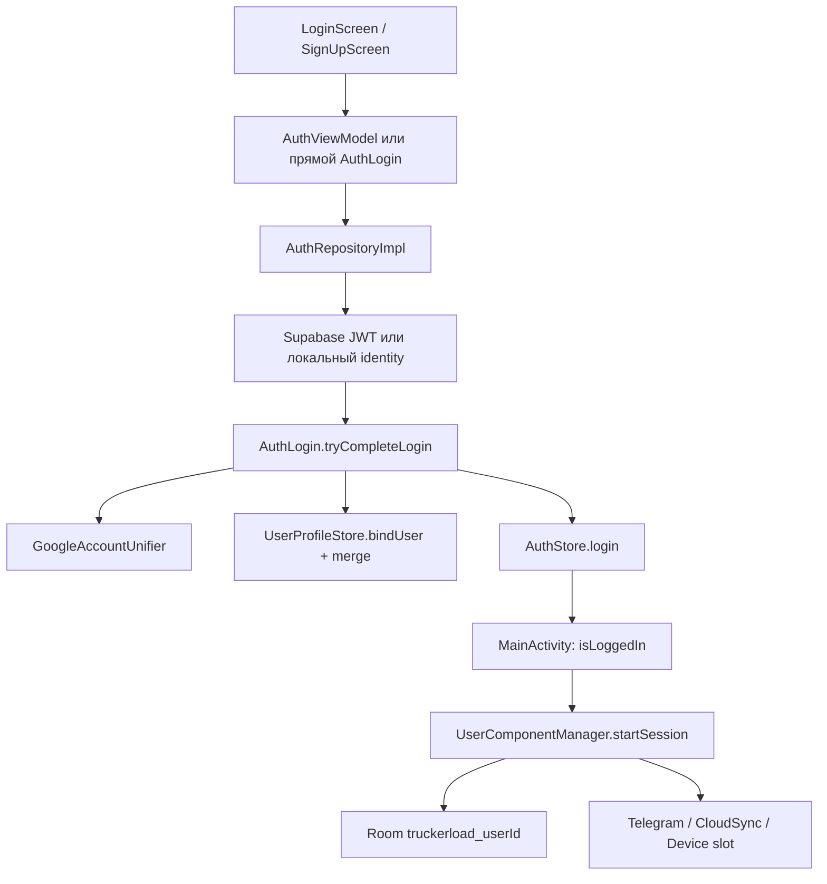

# Отчёт: функция логина и её роль в TruckerLoad

Дата: 2026-08-23  
Объект: Android-клиент (`truckerload/app`), слои `AuthLogin` / `AuthStore` / `AuthRepository` / `MainActivity`.

## 1. Короткий вывод

Логин в TruckerLoad — не просто экран входа. Это **ключ сессии аккаунта**: без успешного `AuthStore.login` приложение не открывает журнал, не поднимает per-account Room, не стартует Telegram-бот и не подключает облачную синхронизацию.

После **первого** успешного входа сессия пишется в EncryptedSharedPreferences. Следующие холодные старты пропускают UI логина, пока пользователь не нажмёт Logout.

`LOCAL_ONLY_MODE=true` **не отключает логин**. Он только выключает Supabase / cloud-воркеры. Гостевой id `local_dev` `MainActivity` принудительно разлогинивает: в прод-потоке нужен Google или email.

## 2. Где живёт «функция логина»

Есть несколько слоёв с похожими именами. Роли разные.

| Слой | Файл | Что делает |
| --- | --- | --- |
| UI | `presentation/screens/login/LoginScreen.kt` | Кнопки Google / Email. Сам не пишет сессию. |
| ViewModel | `presentation/screens/auth/AuthViewModel.kt` | Loading, ошибки, тосты, biometric-offer. |
| Репозиторий | `data/repository/auth/AuthRepositoryImpl.kt` | Google / email / anonymous + fallback. |
| Завершение | `data/preferences/AuthLogin.kt` | Единая точка: id + профиль + `AuthStore.login`. |
| Сессия | `data/preferences/AuthStore.kt` | Process-wide state + диск. |
| Ворота | `presentation/MainActivity.kt` | Смотрит `isLoggedIn` и собирает user-граф. |

Регистрация (`SignUpScreen`) **обходит** `AuthViewModel` и вызывает `AuthLogin.completeLogin` напрямую. Это второй вход в ту же сессионную функцию.



## 3. Ядро: `AuthLogin.completeLogin`

Это и есть «наша логин-функция» для всего приложения.

```kotlin
fun completeLogin(
    authStore, userProfileStore,
    userId, profile,
    rememberMe = true,
    accessToken, refreshToken, googleIdToken,
    aliasUserIds, provider,
)
```

Порядок шагов:

1. **Канонический id.** Если есть Google `sub`, id всегда `google_<sha256(sub)>`. Один Google-аккаунт = один TruckerLoad-логин, даже если параллельно пришёл Supabase UUID.
2. **Проверка identity.** Email обязателен, кроме `local_*`, `google_*` и `local_dev`.
3. **Unify journal.** `authStore.unifyGoogleJournal` переносит leftover-журналы со старых UUID/alias в канонический Google-id (`GoogleAccountUnifier`).
4. **Профиль.** `userProfileStore.bindUser(id)`, затем `ProfileIdentity.mergeLoginProfile`: ник с облака побеждает, но имя/фото, которые водитель уже задал в приложении, Google не затирает.
5. **Сессия.** `authStore.login(...)` с `rememberMe = true` всегда. Комментарий в коде: следующий cold start не должен снова спрашивать логин.

`tryCompleteLogin` — безопасная обёртка: через `AccountIds.resolveOrNull` выбирает id по приоритету

**Google `sub` → Supabase UUID → `local_<hash(email)>`**

и возвращает `false`, если identity неполная (например Google-токен без email и без `sub`).

Задержка ~400 мс в `AuthRepositoryImpl.completeLoginResult` оставлена как UX-пауза перед переходом.

## 4. `AuthStore.login`: что именно «открывается»

`AuthStore` — process-wide singleton-state (companion object). Любой `AuthStore(context)` видит ту же сессию: Telegram-воркеры и виджеты не зависят от Compose.

`login()` делает:

- ещё раз канонизирует id по `googleSub`;
- переносит alias-журналы, если предыдущий id того же Google `sub` был другим;
- ставит провайдер: `GOOGLE` / `EMAIL` / `LOCAL`;
- **реальные** Google/email сессии всегда пишутся на диск (даже если `rememberMe=false`);
- ephemeral `LOCAL` без `rememberMe` живёт только в памяти процесса;
- токены (`access`, `refresh`, Google ID token) — в EncryptedSharedPreferences; если Keystore недоступен, секреты остаются в RAM, старая зашифрованная копия на диске не затирается;
- публикует `isLoggedIn`, `userId`, `email`, `sessionHealth`.

На старте процесса store читает диск один раз (`bootstrapped`). Если `is_logged_in` + `user_id` есть — UI логина не показывается.

`logout()` чистит и память, и диск.

## 5. Три способа войти

### 5.1 Google

Экран: branded `GoogleSignInButton` → `AuthViewModel.onGoogleSignInClick`.

Credential Manager **намеренно выключен** (`requestGoogleIdToken` всегда `FallBackToLegacy`): на медленных устройствах он давал 20-секундный timeout. Используется legacy account picker.

Дальше:

1. Если Supabase сконфигурирован и есть ID token — `signInWithIdToken`, JWT + профиль из облака.
2. Любая ошибка облака → **локальный Google-identity** (claims из ID token: email, name, `sub`, picture) + toast fallback.
3. Без Supabase — сразу локальный путь.
4. `AuthLogin.tryCompleteLogin` + `DeviceSlotLogin.afterSessionPersisted`.

### 5.2 Email + пароль

- Пустой email/пароль — валидация на клиенте.
- Без Supabase: только уже существующий локальный verifier (`AuthCredentialsStore`, PBKDF2). **Авторегистрации при ошибке логина нет** — иначе создавались аккаунты с опечатками.
- С Supabase: `signInWithPassword`, затем локальный verifier сохраняется best-effort. Если облако упало, но локальный пароль верный — offline fallback.
- После успеха email-аккаунту могут предложить biometric unlock.

Регистрация (`SignUpScreen`): политика пароля ≥8 / цифра / заглавная, согласия ToS/возраст, телефон. Локальный signup помечает email verified сразу (письма нет). Cloud signup запускает soft OTP-экран.

### 5.3 Anonymous / `local_dev`

`signInAnonymously` есть в API (`AuthProvider.LOCAL`, email `local@truckerload.local`), кнопки на `LoginScreen` нет.

`MainActivity` явно отвергает этот id:

```kotlin
if (isLoggedIn && userId == AccountIds.LOCAL_DEV) {
    authStore.logout()
    userComponentManager.endSession()
}
```

То есть гость больше не является рабочим режимом UI. `LOCAL_ONLY_MODE` оставляет Google/email, но без cloud-воркеров.

Sign in with Apple зарезервирован в KMP `AuthProvider.APPLE`, UI нет.

## 6. Роль логина в приложении

Логин — граница доверия и изоляции данных. После `isLoggedIn=true` происходит цепочка, без которой продукт не работает.

### 6.1 Ворота UI

`MainActivity` слушает `authStore.isLoggedIn` + `userId`:

| Состояние | Что видит водитель |
| --- | --- |
| `sessionReady=false` | Спиннер |
| не залогинен / нет `UserComponent` | `AuthNavHost` (Login / SignUp) |
| сессия есть | `BiometricUnlockGate` (только EMAIL) → `NavGraph` |

`NavGraph` ещё раз проверяет `isLoggedIn` и не монтирует журнал, пока сессии нет.

### 6.2 Per-account Room и user-граф

`UserComponentManager.startSession(userId)`:

- закрывает предыдущую Room, если аккаунт сменился;
- открывает файл `truckerload_<sanitizedUserId>`;
- создаёт репозитории журнала: loads, paychecks, diesel, weeks, photos, scans, analytics, social, maintenance, registration.

Это главная роль логина для продукта: **чужой журнал не должен остаться открытым**. Hilt Singleton хранит только auth/settings; Room не application-singleton.

### 6.3 Пост-логин онбординг

После ворот, но до Home, `NavGraph` может показать по очереди:

1. `EmailVerificationScreen` — soft 6-digit код на устройстве (только EMAIL, если pending).
2. `ProfileSetupScreen` — имя, CDL, хаб и т.д.
3. `TelegramOnboardingScreen` — токен бота.

Deep links виджетов ждут, пока эти гейты пройдены.

### 6.4 Облако и JWT

Supabase Auth даёт UUID + Bearer JWT. Это **identity**, не база приложения.

`KtorAuthInterceptor` вешает `Authorization: Bearer <accessToken>` и `X-Device-Id` на каждый запрос. Ktor сверяет `snapshot.accountId` с JWT subject.

После готовности сессии (если не `LOCAL_ONLY_MODE`) стартуют:

- `CloudSyncEngine.onSessionReady` (hydrate / push-pull);
- `OutboundSyncWorker`, `CloudSyncWorker`, `MediaSyncWorker`;
- `ServerTelegramInboxWorker`;
- `PushTokenRegistrationWorker`;
- периодический Google Drive backup, если включён.

UI при этом остаётся на Room. Сломанный refresh не выкидывает из журнала: `SilentAuthRestorer` ставит `SESSION_UNCONFIRMED` / `OFFLINE_LOCAL`, баннер `AuthStatusBanner` мягкий.

### 6.5 Слот устройства

`DeviceSlotLogin.afterSessionPersisted` регистрирует устройство на бэкенде: **один телефон + один планшет** на аккаунт.

Если слот занят или нет токена при required-регистрации — сессия сразу `logout()`, пользователь остаётся на логине с ошибкой. Тот же отказ возможен позже в `CloudSyncEngine` (`DEVICE_SLOT_DENIED`) — тогда `MainActivity` тоже разлогинивает.

### 6.6 Telegram, виджеты, воркеры

Почти все фоновые компоненты читают `AuthStore.currentUserIdOrNull()`:

- `TelegramBotForegroundService` / `TelegramSyncWorker` / boot receiver — без userId не стартуют;
- при смене аккаунта старый poller гасится (`stopForLogout`), затем поднимается бот нового пользователя;
- виджеты и settings-сторы (`RpmThresholds`, weekly goal, Drive prefs) ключуются тем же userId;
- `AppDatabase.getInstanceForActiveUser` возвращает `null`, если сессии нет — воркер не лезет в чужой/пустой файл.

Logout идёт через `SessionTeardown.signOut`: сначала unregister device + стоп FGS, потом `endSession()` (close Room), потом `authStore.logout()`, затем Google Play Services `signOut` (чтобы следующий Google-логин мог выбрать другой аккаунт).

## 7. Идентификаторы аккаунта

`AccountIds` — правило изоляции данных.

| Источник | Id на диске | Пример |
| --- | --- | --- |
| Google `sub` | `google_<16 hex SHA-256>` | один аккаунт на все устройства |
| Supabase UUID | как есть | email-cloud без Google |
| только email | `local_<16 hex SHA-256>` | offline email |
| guest (отвергнут UI) | `local_dev` | debug API |

Приоритет unify: Google всегда побеждает UUID. Alias UUID копируется в Google-журнал, чтобы не потерять старые лоуды.

## 8. Восстановление сессии (не логин)

`SilentAuthRestorer.restore` вызывается **после** показа журнала:

- `LOCAL_ONLY_MODE` → сразу `VERIFIED`;
- нет сети → `OFFLINE_LOCAL`;
- Google/email + refresh token → `SupabaseAuthService.refreshSession`;
- refresh не удался → `SESSION_UNCONFIRMED`, журнал не закрывается.

Важно: cold start **не** вызывает Credential Manager / Google sheet. Документ `GOOGLE_AUTH_OFFLINE_GUIDE.md` в части 2 всё ещё описывает silent Credential Manager — это уже не так; источник истины — `SilentAuthRestorer.kt`.

## 9. Что покрыто тестами

Юнит-тесты бьют в домен логина, не в Compose-экран:

- `AuthLoginNicknameMergeTest` — merge ника/имени при повторном входе;
- `GoogleSessionPersistTest` — persist + `tryCompleteLogin` игнорирует UUID при одном Google `sub`;
- `AuthRegistrationPersistTest`, `AuthCredentialsNormalizeTest`;
- `AuthRepositoryArchitectureTest` — LoginScreen без `SupabaseClient`, device-slot до удержания сессии, ID token проходит в `completeLogin`;
- `AccountIdsTest`, `GoogleAccountUnifierTest`;
- instrumented `MultiUserIsolationInstrumentedTest` — два `AuthStore.login` не протекают лоудами.

`AuthViewModel` отдельным unit-тестом не покрыт (в Phase 3.5 это ещё чеклист).

## 10. Замечания и риски

1. **Два `AuthProvider`.** Android: `LOCAL / EMAIL / GOOGLE` в `AuthSessionHealth.kt`. KMP: `EMAIL / GOOGLE / APPLE` в `shared/domain`. Это разные типы; путать нельзя.
2. **Два пути завершения.** Login идёт через `AuthRepository`; SignUp пишет сессию сам. Device-slot на локальном signup не вызывается (нет JWT — `Skipped`/`Unavailable` и так). Расхождение стоит держать в голове при правках.
3. **`local_dev` мёртв в UI, жив в API.** `signInAnonymously` и `AppDatabase.getInstance()` в LOCAL_ONLY всё ещё знают guest. `MainActivity` его выкидывает. Документы местами говорят «полностью офлайн без логина» — это устарело.
4. **Credential Manager выключен.** Google-вход зависит от legacy Play Services picker. На эмуляторе без Google-аккаунта кнопка не доведёт сессию.
5. **Device slot жёсткий.** Нет токена + required register = logout сразу после успешного `completeLogin`. Для друзей-APK без `SYNC_BACKEND_URL` binder no-op (`Skipped`) — ок.
6. **Секреты.** Пароль в облако только по TLS; на диске PBKDF2. JWT/Google token — encrypted prefs. При plaintext Keystore-fallback токены в RAM, баннер предупреждает.

## 11. Практический смысл для продукта

Логин отвечает на вопрос **«чей это журнал»**, а не «можно ли пользоваться калькулятором».

- Водитель A и водитель B на одном телефоне получают разные Room-файлы и разные Telegram-токены.
- Журнал, дизель, зарплаты, цели, фото, Crowd RPM, виджет — всё ключуется от userId, который выставляет только логин.
- Облако (снапшот, медиа, FCM, server Telegram inbox) включается только если у сессии есть JWT и слот устройства свободен.
- Без логина приложение — это только экран входа. Ядро продукта (добавить груз / RPM / недельная цель) недоступно.

## 12. Ключевые файлы

- `app/src/main/java/com/truckerload/data/preferences/AuthLogin.kt`
- `app/src/main/java/com/truckerload/data/preferences/AuthStore.kt`
- `app/src/main/java/com/truckerload/data/preferences/AccountIds.kt`
- `app/src/main/java/com/truckerload/data/repository/auth/AuthRepositoryImpl.kt`
- `app/src/main/java/com/truckerload/presentation/screens/auth/AuthViewModel.kt`
- `app/src/main/java/com/truckerload/presentation/screens/login/LoginScreen.kt`
- `app/src/main/java/com/truckerload/presentation/MainActivity.kt`
- `app/src/main/java/com/truckerload/di/UserComponentManager.kt`
- `app/src/main/java/com/truckerload/data/auth/SilentAuthRestorer.kt`
- `app/src/main/java/com/truckerload/sync/SessionTeardown.kt`
- `docs/AUTH_GOOGLE.md`, `docs/EMAIL_AUTH_HYBRID_GUIDE.md`, `docs/CLOUD_DATA_SYNC.md`
