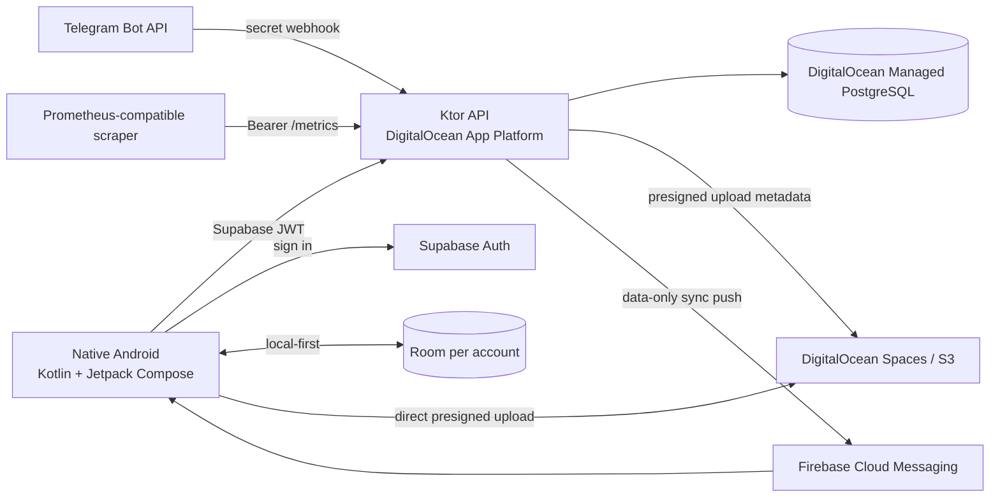

# Target architecture

## Decisions

- Keep the native Android application. Kotlin, Room, WorkManager, and Jetpack Compose
  remain the offline-first client. There is no Expo or React Native migration.
- Ktor on JDK 21 is the stateless API and Telegram webhook receiver.
- Supabase Auth remains the identity provider. Android obtains the JWT; Ktor validates
  issuer, audience, signature, and UUID subject. Supabase is not the application
  database.
- DigitalOcean is the one infrastructure cloud. App Platform provides managed TLS and
  container execution; Managed PostgreSQL stores account-scoped state; Spaces stores
  media through the S3 API. Supabase Auth, Telegram, and Firebase are external product
  integrations, not additional workload clouds.
- PostgreSQL is the source of truth for cloud snapshots, sync cursors, Telegram links
  and inbox, media metadata, and FCM device tokens. Room remains the immediate source
  for offline UI and the replay/fallback source during cloud incidents.
- Media bytes do not pass through Ktor in production. Ktor authorizes metadata and
  issues a short-lived presigned URL; Android uploads directly to Spaces and confirms
  completion.
- Telegram runs server-side only when `TELEGRAM_SYNC_MODE=server`; the authenticated
  inbox is idempotent by Telegram `update_id`. Device mode remains the rollback path.
- FCM is a wake-up signal, not a data channel. A push contains only `type=sync`; clients
  fetch authenticated state from Ktor.
- Do not add Valkey/Redis yet. The initial single backend instance and PostgreSQL
  constraints provide sufficient coordination. Add a cache or distributed lock only
  after measured contention, rate-limiting, or queue requirements cannot be met safely
  in PostgreSQL.
- Do not add Apple services until an iOS client exists. There is no APNs credential,
  iOS schema branch, or Apple sign-in surface in the current target.

## Android dependency scopes

- Hilt's `SingletonComponent` owns only process-wide wrappers backed by the
  application context: auth/session credentials, the active profile wrapper, settings,
  and push-token storage.
- Room and repository objects remain account-scoped. `MainActivity` rebuilds that
  graph after login and closes the active database on logout, preventing data access
  from leaking across account switches.
- Compose continues to receive the active account graph through `CompositionLocal`
  while the migration proceeds incrementally.
- Existing WorkManager workers remain framework-constructed. HiltWorker and a custom
  worker factory are intentionally deferred until every worker can be migrated as one
  safe change.

## Trust boundaries

- Android stores local account data and bearer credentials; it never receives the
  server Telegram bot token, database credentials, Space secret key, metrics token, or
  Firebase service account.
- App Platform holds runtime secrets as encrypted environment variables. No production
  secret belongs in Git, an image layer, a URL query parameter, or a build artifact.
- Every account API derives ownership from the verified JWT subject. Client-provided
  account IDs are checked and never establish authorization.
- Object keys are server-generated under the authenticated account prefix. Presigned
  uploads expire and are checked against expected content type and byte count.
- Metrics use only bounded method/status/result dimensions. Logs omit authorization,
  secret headers, query strings, and raw bodies.

## Availability and scaling

Start with one backend instance because the workload is small and the webhook/API are
already stateless. PostgreSQL uniqueness makes Telegram delivery idempotent, so App
Platform may scale horizontally later. Before scaling, validate Hikari connection
budgets against the managed database limit and base decisions on HTTP latency, pool
wait time, webhook backlog, and error rate. Object storage and database readiness gate
traffic; liveness only restarts a wedged process.
