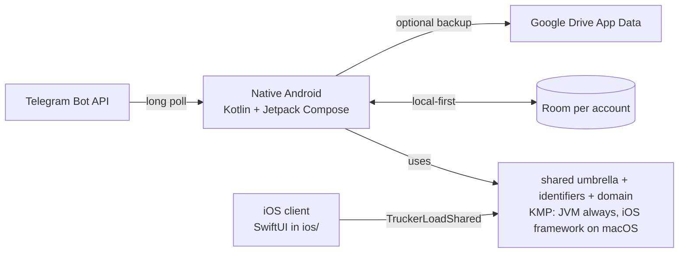

# Target architecture

## Decisions

- Keep the native Android application. Kotlin, Room, WorkManager, and Jetpack Compose
  remain the offline-first client. There is no Expo or React Native migration.
  Portable domain and shared identifiers live in Kotlin Multiplatform modules
  (`:shared:contract`, `:shared:domain`, `:shared` umbrella) so the iOS client in `ios/`
  can share them.
- There is no product backend, Supabase Auth, or Ktor sync server. Account identity,
  the journal, and the Telegram bot live on the device.
- Google Sign-In identifies the driver on this phone. Optional Google Drive backup
  copies the local journal to the user's own Drive App Data folder.
- Room is the source of truth. Drive is an opt-in backup, not a multi-device live sync.
- The Telegram bot runs in an Android foreground service (long poll). There is no
  server webhook mode.
- Optional Firebase Crashlytics is enabled only when `app/google-services.json` is
  present. There is no FCM cloud-sync wake-up.
- Do not add Sign in with Apple or APNs credentials until the Apple Developer
  Program account is enrolled at publication. The SwiftUI shell in `ios/` already
  links `TruckerLoadShared`. See [KMP_IOS_ROADMAP.md](KMP_IOS_ROADMAP.md).

## Android dependency scopes

- Hilt's `SingletonComponent` owns only process-wide wrappers backed by the
  application context: auth/session credentials, the active profile wrapper, and
  settings.
- Room and repository objects remain account-scoped. `MainActivity` rebuilds that
  graph after login and closes the active database on logout, preventing data access
  from leaking across account switches.
- Compose continues to receive the active account graph through `CompositionLocal`.
